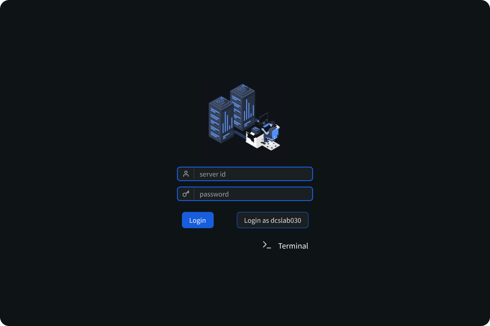
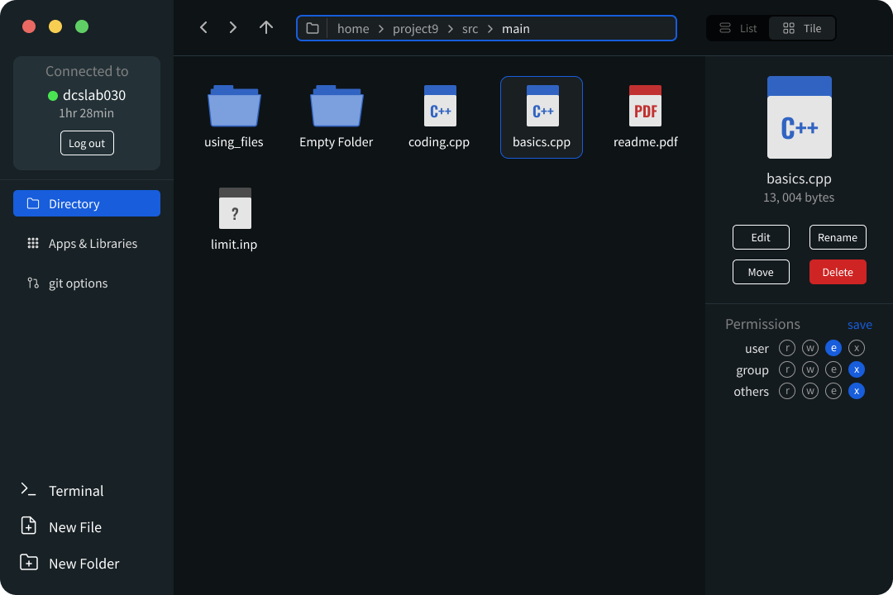
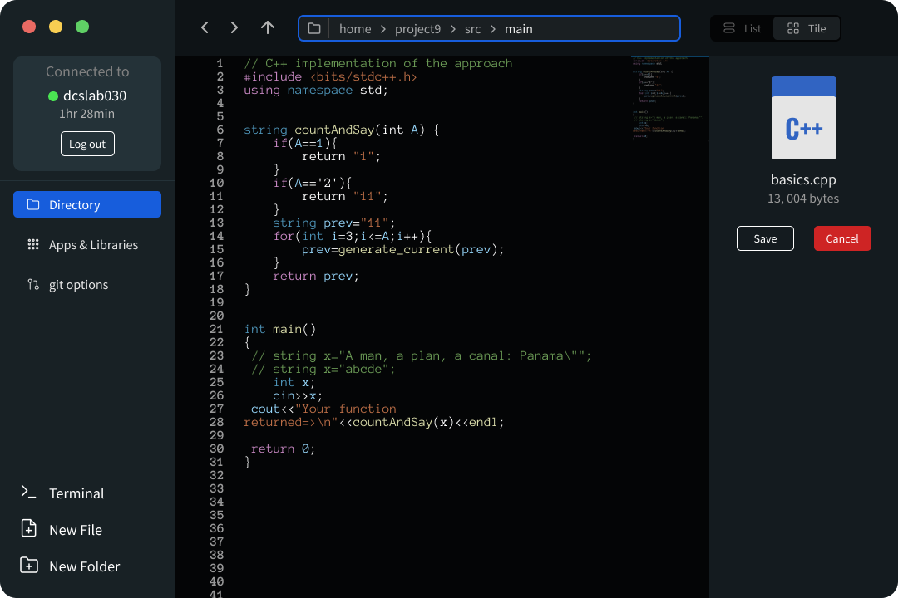

# Remote-Host-Services (FrontEnd)
RHS is created for seamless experience of servers visually rather than the terminals. You can also edit and download your files on server, view image files right in the browser.

## Usage
- Install RHS using `npm install -g remotehost`
- Run RHS using `remotehost`

## Installation for Developers
- Run the backend server from [This Repository]()
- Build the file using `npm run build`
- Start the server using `npm run dev` and open [Port 8000](http://localhost:8000/)

## Screenshots

<!-- 

 -->
